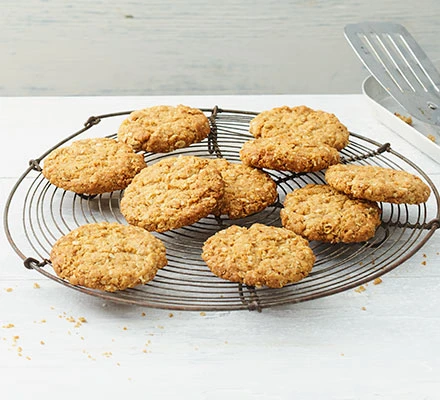

Goldylocks has become the queen of the porridge ats and has developed these new fabulous golden porridge oat cokkies that will bring the bears running to your door.

## Ingredients

* 75g wholemeal flour
* 1 tsp baking powder
* 75g porridge oats
* 50g caster sugar
* 75g butter
* 1 tbsp golden syrup
* 2 tbsp milk

### Method

* STEP 1

  Heat the oven to 180C/160C fan/gas 4. Line a baking tray with baking parchment.
* STEP 2

  Sift the flour into a bowl. Mix in the baking powder, porridge oats and sugar.
* STEP 3

  Melt the butter, syrup and milk in a small saucepan or in the microwave and stir.
* STEP 4

  Add to the dry ingredients. Mix until the liquid covers all the oat mixture and until well combined.
* STEP 5

  Spoon onto a baking tray and shape into rounds, leaving space between each biscuit as they will spread whilst cooking.
* STEP 6

  Bake for 10-15 mins, or until golden brown. Leave to cool for 5 mins before removing from tray.