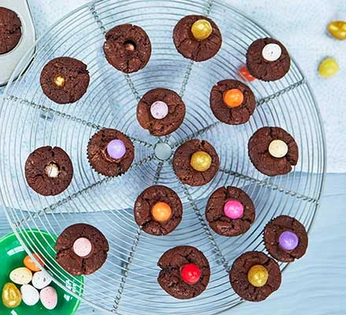

## Ingredients

* 175g [butter](https://www.bbcgoodfood.com/glossary/butter-glossary), chopped
* 150g [dark chocolate](https://www.bbcgoodfood.com/glossary/dark-chocolate-glossary)
* 250g [light brown soft sugar](https://www.bbcgoodfood.com/glossary/sugar-glossary)
* 85g [self-raising flour](https://www.bbcgoodfood.com/glossary/flour-glossary)
* 50g cocoa powder
* 3 [large eggs](https://www.bbcgoodfood.com/glossary/egg-glossary), beaten
* 100g [milk chocolate chips](https://www.bbcgoodfood.com/glossary/milk-chocolate-glossary)
* 24 mini chocolate eggs, plus extra to decorate

### Method

* STEP 1

  Heat oven to 180C/160C fan/gas 4. Line 24 holes of a mini muffin tray with paper cases. Put the butter, dark chocolate and sugar in a pan and heat it very gently, stirring all the time until the butter and chocolate have melted. Remove from the heat and leave to cool for a few mins.
* STEP 2

  Meanwhile, sift the flour, cocoa and a good pinch of salt into a large bowl. Stir in the warm, melted chocolate mixture and the beaten eggs, then add half the chocolate chips and mix until just combined. 
* STEP 3

  Divide the mixture between the cases and place a mini egg into the middle of each muffin, pushing down gently. Bake for 12-15 mins until cooked but still gooey in the centre – they will continue cooking a little as they cool down. Leave to cool for 10 mins in the tin before transferring to a [wire rack](https://www.bbcgoodfood.com/content/kimberley-wilsons-top-five-cooling-racks) to cool completely.
* STEP 4

  Melt the rest of the chocolate chips in short bursts in the [microwave](https://www.bbcgoodfood.com/review/best-microwaves-test), or in a bowl set over a pan of simmering water, stirring frequently. Leave to cool until it is quite thick, then dot a small amount on each cake and stick on some more mini eggs.